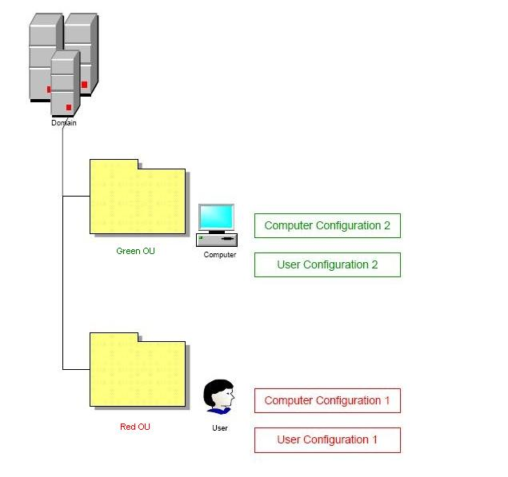
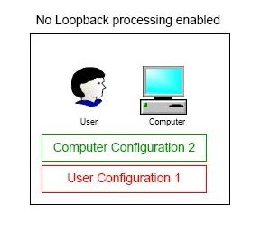
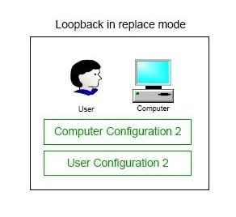
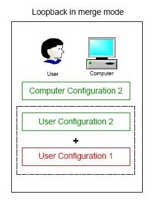

# Loopback processing Example

### Domain Configuration 
#### Organizational units 
The Domain has two different organizational units (OU) $\color{green}{\textsf{Green}}$ and $\color{red}{\textsf{Red}}$.  
- $\color{green}{\textsf{Green}}$ OU contains a Computer account
- $\color{red}{\textsf{Red}}$ OU contains User account

#### Policies
The $\color{green}{\textsf{Green}}$ policy, which has settings $\color{green}{\textsf{Computer Configuration 2}}$ and $\color{green}{\textsf{User Configuration 2}}$ is applied to the OU with the computer account. 

The $\color{red}{\textsf{Red}}$ policy, which has settings $\color{red}{\textsf{Computer Configuration 1}}$ and $\color{red}{\textsf{User Configuration 1}}$, is applied to the OU with the User account. If you have a look at the picture below it will become clearer.

### Normal Group Policy processing 
If Loopback processing of Group Policy is not enabled and our User logs on to our Computer, the User gets $\color{green}{\textsf{Computer Configuration 2}}$ and $\color{red}{\textsf{User Configuration 1}}$. This is absolutely standard situation, where policies are applied according to the belonging to the OU. User belongs to the Red OU, he gets the $\color{red}{\textsf{Red User Configuration 1}}$ accordingly.

### Loopback processing - Replace Mode
The User is getting $\color{green}{\textsf{User Configuration 2}}$ despite of the fact that he belongs to the Red OU. So, what has happened in this scenario, the $\color{red}{\textsf{User Configuration 1}}$ was replaced with the $\color{green}{\textsf{User Configuration 2}}$ , i.e. with the configuration applied to the Computer account.

### Loopback processing - Merge Mode
In Merge mode, the user is getting in order $\color{red}{\textsf{User Configuration 1}}$ and $\color{green}{\textsf{User Configuration 2}}$
If there is a conflict, as the Computer’s policy is applied last, the User Configuration 2 would be enforced.

